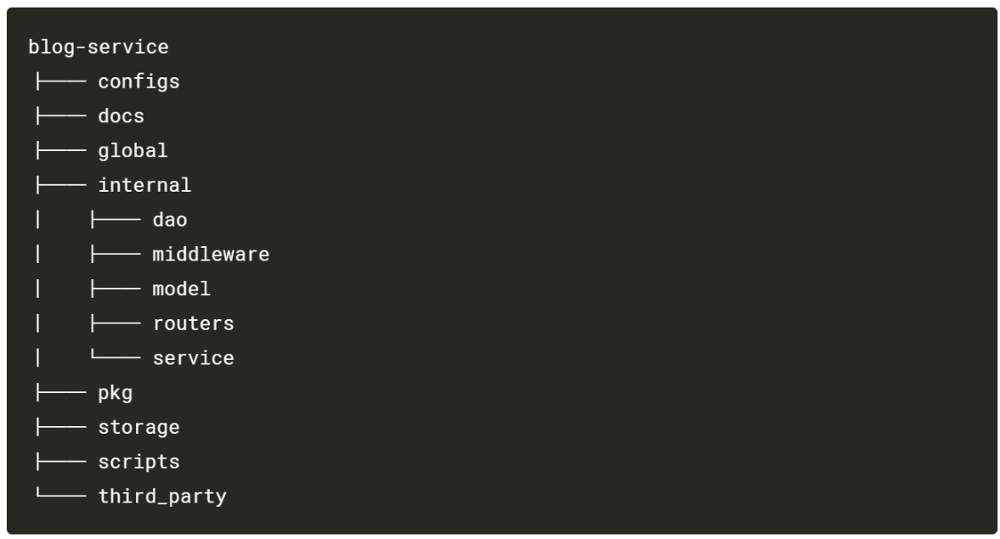
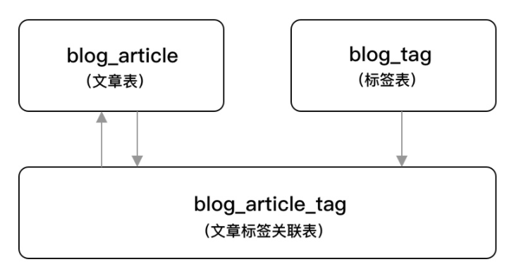
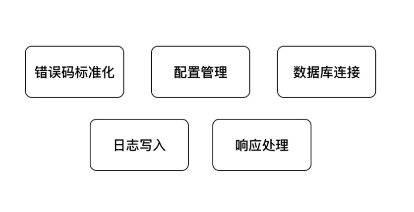
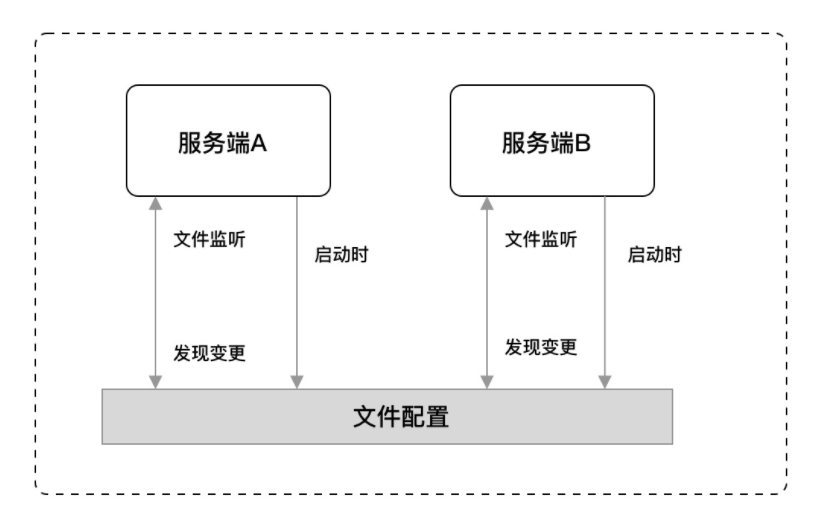

##### Version 0.1

Version 0.1 主要是项目的准备阶段，搭建一个简单的项目，基本实现项目骨架，但项目的鲁棒性不强。

这个部分主要分为三个阶段：
- 项目设计
- 公共组件
- 接口文档

## 1. 项目设计

### 1.1 目录结构设计



目录结构如下：

- configs：配置文件。
- docs：文档集合。
- global：全局变量。
- internal：内部模块。
  - dao：数据访问层（Database Access Object），所有与数据相关的操作都会在 dao 层进行，例如 MySQL、ElasticSearch 等。
  - middleware：HTTP 中间件。
  - model：模型层，用于存放 model 对象。
  - routers：路由相关逻辑处理。
  - service：项目核心业务逻辑。
- pkg：项目相关的模块包。
  - app
  - convert
  - errcode
  - logger
  - setting
- storage：项目生成的临时文件。
- scripts：各类构建，安装，分析等操作的脚本。
- third_party：第三方的资源工具，例如 Swagger UI。

### 1.1.1 数据库设计

实现两大基础业务功能：

- 标签管理
- 文章管理



#### 创建数据库

```mysql
CREATE DATABASE
IF NOT EXISTS blog_service DEFAULT CHARACTER SET utf8mb4 DEFAULT COLLATE utf8mb4_general_ci;
```

#### 标签表

```mysql
CREATE TABLE `blog_tag` (
  `id` int(10) unsigned NOT NULL AUTO_INCREMENT,
  `name` varchar(100) DEFAULT '' COMMENT '标签名称',
  `created_on` int(10) unsigned DEFAULT '0' COMMENT '创建时间',
  `created_by` varchar(100) DEFAULT '' COMMENT '创建人',
  `modified_on` int(10) unsigned DEFAULT '0' COMMENT '修改时间',
  `modified_by` varchar(100) DEFAULT '' COMMENT '修改人',
  `deleted_on` int(10) unsigned DEFAULT '0' COMMENT '删除时间',
  `is_del` tinyint(3) unsigned DEFAULT '0' COMMENT '是否删除 0 为未删除、1 为已删除',
  `state` tinyint(3) unsigned DEFAULT '1' COMMENT '状态 0 为禁用、1 为启用',
  PRIMARY KEY (`id`)
) ENGINE=InnoDB DEFAULT CHARSET=utf8mb4 COMMENT='标签管理';
```

#### 文章表

```mysql
CREATE TABLE `blog_article` (
  `id` int(10) unsigned NOT NULL AUTO_INCREMENT,
  `title` varchar(100) DEFAULT '' COMMENT '文章标题',
  `desc` varchar(255) DEFAULT '' COMMENT '文章简述',
  `cover_image_url` varchar(255) DEFAULT '' COMMENT '封面图片地址',
  `content` longtext COMMENT '文章内容',
  `created_on` int(10) unsigned DEFAULT '0' COMMENT '创建时间',
  `created_by` varchar(100) DEFAULT '' COMMENT '创建人',
  `modified_on` int(10) unsigned DEFAULT '0' COMMENT '修改时间',
  `modified_by` varchar(100) DEFAULT '' COMMENT '修改人',
  `deleted_on` int(10) unsigned DEFAULT '0' COMMENT '删除时间',
  `is_del` tinyint(3) unsigned DEFAULT '0' COMMENT '是否删除 0 为未删除、1 为已删除',
  `state` tinyint(3) unsigned DEFAULT '1' COMMENT '状态 0 为禁用、1 为启用',
  PRIMARY KEY (`id`)
) ENGINE=InnoDB DEFAULT CHARSET=utf8mb4 COMMENT='文章管理';
```

#### 文章标签关联表

```mysql
CREATE TABLE `blog_article_tag` (
  `id` int(10) unsigned NOT NULL AUTO_INCREMENT,
  `article_id` int(11) NOT NULL COMMENT '文章 ID',
  `tag_id` int(10) unsigned NOT NULL DEFAULT '0' COMMENT '标签 ID',
  `created_on` int(10) unsigned DEFAULT '0' COMMENT '创建时间',
  `created_by` varchar(100) DEFAULT '' COMMENT '创建人',
  `modified_on` int(10) unsigned DEFAULT '0' COMMENT '修改时间',
  `modified_by` varchar(100) DEFAULT '' COMMENT '修改人',
  `deleted_on` int(10) unsigned DEFAULT '0' COMMENT '删除时间',
  `is_del` tinyint(3) unsigned DEFAULT '0' COMMENT '是否删除 0 为未删除、1 为已删除',
  PRIMARY KEY (`id`)
) ENGINE=InnoDB DEFAULT CHARSET=utf8mb4 COMMENT='文章标签关联';
```

### 1.1.2 创建Model

创建Model的目的是要和数据库表对应起来

#### 创建公共Model

在 internal/model 目录下创建 model.go 文件，写入如下代码：

```go
type Model struct {
	ID         uint32 `gorm:"primary_key" json:"id"`
	CreatedBy  string `json:"created_by"`
	ModifiedBy string `json:"modified_by"`
	CreatedOn  uint32 `json:"created_on"`
	ModifiedOn uint32 `json:"modified_on"`
	DeletedOn  uint32 `json:"deleted_on"`
	IsDel      uint8  `json:"is_del"`
}
```

#### 创建标签Model

在internal/model 目录下创建tag.go 文件，写入如下代码：

```go
type Tag struct {
	*Model
	Name  string `json:"name"`
	State uint8  `json:"state"`
}

func (t Tag) TableName() string {
	return "blog_tag"
}
```

#### 创建文章Model

在 internal/model 目录下创建article.go文件，写入如下代码：

```go
type Article struct {
	*Model
	Title         string `json:"title"`
	Desc          string `json:"desc"`
	Content       string `json:"content"`
	CoverImageUrl string `json:"cover_image_url"`
	State         uint8  `json:"state"`
}

func (a Article) TableName() string {
	return "blog_article"
}
```

#### 创建标签-文章Model

```go
type ArticleTag struct {
	*Model
	TagID     uint32 `json:"tag_id"`
	ArticleID uint32 `json:"article_id"`
}

func (a ArticleTag) TableName() string {
	return "blog_article_tag"
}
```

### 1.1.3 创建路由

在完成数据库的设计后，我们需要对业务模块的管理接口进行设计，而在这一块最核心的就是增删改查，我们应该使用RESTful 风格的API，具体来说就是

- GET：读取/检索动作。
- POST：新增/新建动作。
- PUT：更新动作，用于更新一个完整的资源，要求为幂等。
- PATCH：更新动作，用于更新某一个资源的一个组成部分，也就是只需要更新该资源的某一项，就应该使用 PATCH 而不是 PUT，可以不幂等。
- DELETE：删除动作。

#### 标签管理

| 功能         | HTTP 方法 | 路径      |
| ------------ | --------- | --------- |
| 新增标签     | POST      | /tags     |
| 删除指定标签 | DELETE    | /tags/:id |
| 更新指定标签 | PUT       | /tags/:id |
| 获取标签列表 | GET       | /tags     |

#### 文章管理

| 功能         | HTTP 方法 | 路径          |
| ------------ | --------- | ------------- |
| 新增文章     | POST      | /articles     |
| 删除指定文章 | DELETE    | /articles/:id |
| 更新指定文章 | PUT       | /articles/:id |
| 获取指定文章 | GET       | /articles/:id |
| 获取文章列表 | GET       | /articles     |

#### 路由管理

确定了业务接口设计后，需要对业务接口进行一个基础编码，确定其方法原型。在项目目录下的 internal/routers 下新建 router.go，写入代码：

```go
func NewRouter() *gin.Engine {
	r := gin.New()
	r.Use(gin.Logger())
	r.Use(gin.Recovery())
	
	article := v1.NewArticle()
    tag := v1.NewTag()
    apiv1 := r.Group("/api/v1")
    {
        apiv1.POST("/tags", tag.Create)
        apiv1.DELETE("/tags/:id", tag.Delete)
        apiv1.PUT("/tags/:id", tag.Update)
        apiv1.PATCH("/tags/:id/state", tag.Update)
        apiv1.GET("/tags", tag.List)

        apiv1.POST("/articles", article.Create)
        apiv1.DELETE("/articles/:id", article.Delete)
        apiv1.PUT("/articles/:id", article.Update)
        apiv1.PATCH("/articles/:id/state", article.Update)
        apiv1.GET("/articles/:id", article.Get)
        apiv1.GET("/articles", article.List)
    }

	return r
}
```

#### 处理程序

在 internal/routers/api/v1 下新建tag.go 和 article.go，写入如下代码

```go
// tag.go
type Tag struct {}

func NewTag() Tag {
	return Tag{}
}

func (t Tag) Get(c *gin.Context) {}
func (t Tag) List(c *gin.Context) {}
func (t Tag) Create(c *gin.Context) {}
func (t Tag) Update(c *gin.Context) {}
func (t Tag) Delete(c *gin.Context) {}
```

```go
// article.go
type Article struct{}

func NewArticle() Article {
	return Article{}
}

func (a Article) Get(c *gin.Context) {}
func (a Article) List(c *gin.Context) {}
func (a Article) Create(c *gin.Context) {}
func (a Article) Update(c *gin.Context) {}
func (a Article) Delete(c *gin.Context) {}
```

### 1.1.4 启动接入

修改main.go的代码

```go
func main() {
	router := routers.NewRouter()
	s := &http.Server{
		Addr:           ":8080",
		Handler:        router,
		ReadTimeout:    10 * time.Second,
		WriteTimeout:   10 * time.Second,
		MaxHeaderBytes: 1 << 20,
	}
	s.ListenAndServe()
}
```

------

------------

上面我们已经完成了前期准备的第一步，搭建好了基础骨架，接下来我们要进一步完善项目，使其变得更加鲁棒，能够稳定运行。

## 1.2 公共组件

实际上在每个公司的项目中，都会有一类组件，我们常称其为基础组件，又或是公共组件，它们是不带强业务属性的，串联着整个应用程序，一般由负责基建或第一批搭建的该项目的同事进行梳理和编写，如果没有这类组件，谁都写一套，是非常糟糕的，并且这个应用程序是无法形成闭环的。

这一节我们将使用以下五个组件，来保证应用程序的标准化，这些也是Web应用中最常用的一些基础组件。



### 1.2.1 错误码标准化

在与客户端的交互过程中，有两种交互可能：**正确响应下的结果集返回、错误相应的错误码和消息体返回**，但是在错误返回时，往往可能有多种多样的错误，因此需要错误码的标准化处理，提前预判，会造成较大的麻烦，其实这部分用swich-case就可以解决，但我们将他们封装起来，更加标准化。


#### 公共错误码

在在项目目录下的 `pkg/errcode` 目录新建 common_code.go 文件，用于预定义项目中的一些公共错误码，便于引导和规范大家的使用

```go
var (
	Success                   = NewError(0, "成功")
	ServerError               = NewError(10000000, "服务内部错误")
	InvalidParams             = NewError(10000001, "入参错误")
	NotFound                  = NewError(10000002, "找不到")
	UnauthorizedAuthNotExist  = NewError(10000003, "鉴权失败，找不到对应的 AppKey 和 AppSecret")
	UnauthorizedTokenError    = NewError(10000004, "鉴权失败，Token 错误")
	UnauthorizedTokenTimeout  = NewError(10000005, "鉴权失败，Token 超时")
	UnauthorizedTokenGenerate = NewError(10000006, "鉴权失败，Token 生成失败")
	TooManyRequests           = NewError(10000007, "请求过多")
)
```

#### 错误处理

在`pkg/errcode`目录新建 errcode.go 文件，编写常用的一些错误处理公共方法，标准化我们的输出

```go
type Error struct{
    code 	int 	`json:code`
    msg 	string	`json:msg`
    details []string `json:details`
}

var code map[int]string{}

func NewError(code int, msg string) *Error {
	if _, ok := codes[code]; ok {
		panic(fmt.Sprintf("错误码 %d 已经存在，请更换一个", code))
	}
	codes[code] = msg
	return &Error{code: code, msg: msg}
}

func (e *Error) Error() string {
	return fmt.Sprintf("错误码：%d, 错误信息:：%s", e.Code(), e.Msg())
}

func (e *Error) Code() int {
	return e.code
}

func (e *Error) Msg() string {
	return e.msg
}

func (e *Error) Msgf(args []interface{}) string {
	return fmt.Sprintf(e.msg, args...)
}

func (e *Error) Details() []string {
	return e.details
}

func (e *Error) WithDetails(details ...string) *Error {
	newError := *e
	newError.details = []string{}
	for _, d := range details {
		newError.details = append(newError.details, d)
	}

	return &newError
}

func (e *Error) StatusCode() int {
	switch e.Code() {
	case Success.Code():
		return http.StatusOK
	case ServerError.Code():
		return http.StatusInternalServerError
	case InvalidParams.Code():
		return http.StatusBadRequest
	case UnauthorizedAuthNotExist.Code():
		fallthrough
	case UnauthorizedTokenError.Code():
		fallthrough
	case UnauthorizedTokenGenerate.Code():
		fallthrough
	case UnauthorizedTokenTimeout.Code():
		return http.StatusUnauthorized
	case TooManyRequests.Code():
		return http.StatusTooManyRequests
	}
	return http.StatusInternalServerError
}
```

### 1.2.2 配置管理



- 在启动时：可以进行一些基础应用属性、连接第三方实例（MySQL、NoSQL）等等的初始化行为。

- 在运行中：可以监听文件或其他存储载体的变更来实现热更新配置的效果

#### 安装

```go
go get -u github.com/spf13/viper@v1.4.0
```

Viper是适用于Go应用程序的完整配置解决方法，是目前Go语言中比较流行的文件配置解决方法，它支持处理各种不同类型的配置需求和配置格式。

#### 配置文件

在项目目录下的configs目录新建 config.yaml 文件，写入以下配置：

```go
Server:
  RunMode: debug
  HttpPort: 8000
  ReadTimeout: 60
  WriteTimeout: 60
App:
  DefaultPageSize: 10
  MaxPageSize: 100
  LogSavePath: storage/logs
  LogFileName: app
  LogFileExt: .log
Database:
  DBType: mysql
  Username: root  # 填写你的数据库账号
  Password: rootroot  # 填写你的数据库密码
  Host: 127.0.0.1:3306
  DBName: blog_service
  TablePrefix: blog_
  Charset: utf8
  ParseTime: True
  MaxIdleConns: 10
  MaxOpenConns: 30
```

- Server：服务配置，设置gin的运行模式，默认的HTTP监听端口，允许读取和写入的最大持续时间
- App：应用配置，设置默认每页数量、所允许的最大每页数量以及默认的应用日志存储路径。
- Database：数据库配置，主要是连接实例，主要是连接实例所必需的基础参数。

#### 编写组件

```go
type Setting struct{
    vp *viper.Viper
}

func NewSetting() (*Setting, error) {
	vp := viper.New()
	vp.SetConfigName("config")
	vp.AddConfigPath("configs/")
	vp.SetConfigType("yaml")
	err := vp.ReadInConfig()
	if err != nil {
		return nil, err
	}

	return &Setting{vp}, nil
}
```

接下来我们新建 section.go 文件，用于声明配置属性的结构体并编写读取区段配置的配置方法

```go
type ServerSettingS struct {
	RunMode      string
	HttpPort     string
	ReadTimeout  time.Duration
	WriteTimeout time.Duration
}

type AppSettingS struct {
	DefaultPageSize int
	MaxPageSize     int
	LogSavePath     string
	LogFileName     string
	LogFileExt      string
}

type DatabaseSettingS struct {
	DBType       string
	UserName     string
	Password     string
	Host         string
	DBName       string
	TablePrefix  string
	Charset      string
	ParseTime    bool
	MaxIdleConns int
	MaxOpenConns int
}

func (s *Setting) ReadSection(k string, v interface{}) error {
	err := s.vp.UnmarshalKey(k, v)
	if err != nil {
		return err
	}

	return nil
}
```

#### 添加全局变量

显而易见，config应该是全局可见的，这样有利于各种服务的编写

因此在global目录下新建setting.go文件，填写如下代码：

```go
var (
	ServerSetting   *setting.ServerSettingS
	AppSetting      *setting.AppSettingS
	DatabaseSetting *setting.DatabaseSettingS
)
```

#### 初始配置读取

在main.go中添加如下函数

```go
func init() {
	err := setupSetting()
	if err != nil {
		log.Fatalf("init.setupSetting err: %v", err)
	}
}

func setupSetting() error {
	setting, err := setting.NewSetting()
	if err != nil {
		return err
	}
	err = setting.ReadSection("Server", &global.ServerSetting)
	if err != nil {
		return err
	}
	err = setting.ReadSection("App", &global.AppSetting)
	if err != nil {
		return err
	}
	err = setting.ReadSection("Database", &global.DatabaseSetting)
	if err != nil {
		return err
	}

	global.ServerSetting.ReadTimeout *= time.Second
	global.ServerSetting.WriteTimeout *= time.Second
	return nil
}
```

`init` 方法主要作用是进行应用程序的初始化流程控制，整个应用代码里也只会有一个 `init` 方法，因此我们在这里调用了初始化配置的方法，达到配置文件内容映射到应用配置结构体的作用。

#### 修改服务器配置

修改main.go中main函数的代码：

```go
func main() {
	gin.SetMode(global.ServerSetting.RunMode)
	router := routers.NewRouter()
	s := &http.Server{
		Addr:           ":" + global.ServerSetting.HttpPort,
		Handler:        router,
		ReadTimeout:    global.ServerSetting.ReadTimeout,
		WriteTimeout:   global.ServerSetting.WriteTimeout,
		MaxHeaderBytes: 1 << 20,
	}
	s.ListenAndServe()
}
```

#### 验证

可以通过打断点或者打印输出的方式

### 1.2.3 数据库连接

#### 安装

```go
go get -u github.com/jinzhu/gorm
```

#### 编写组件

打开项目目录 `internal/model` 下的 model.go 文件，新增 NewDBEngine 方法

```go
import (
	...
	"github.com/jinzhu/gorm"
	_ "github.com/jinzhu/gorm/dialects/mysql"
)

type Model struct {...}

func NewDBEngine(databaseSetting *setting.DatabaseSettingS) (*gorm.DB, error) {
	db, err := gorm.Open(databaseSetting.DBType, fmt.Sprintf("%s:%s@tcp(%s)/%s?charset=%s&parseTime=%t&loc=Local",
		databaseSetting.UserName,
		databaseSetting.Password,
		databaseSetting.Host,
		databaseSetting.DBName,
		databaseSetting.Charset,
		databaseSetting.ParseTime,
	))
	if err != nil {
		return nil, err
	}
	
	if global.ServerSetting.RunMode == "debug" {
		db.LogMode(true)
	}
	db.SingularTable(true)
	db.DB().SetMaxIdleConns(databaseSetting.MaxIdleConns)
	db.DB().SetMaxOpenConns(databaseSetting.MaxOpenConns)

	return db, nil
}
```

我们通过上述代码，编写了一个针对创建 DB 实例的 NewDBEngine 方法，同时增加了 gorm 开源库的引入和 MySQL 驱动库 `github.com/jinzhu/gorm/dialects/mysql` 的初始化（不同类型的 DBType 需要引入不同的驱动库，否则会存在问题）。

#### 包全局变量

在项目目录下的 `global` 目录，新增 db.go 文件，新增如下内容：

```go
var (
	DBEngine *gorm.DB
)
```

#### 增加初始化

回到启动文件，也就是项目目录下的 main.go 文件，新增 setupDBEngine 方法初始化，如下：

```go
func init() {
	...
	err = setupDBEngine()
	if err != nil {
		log.Fatalf("init.setupDBEngine err: %v", err)
	}
}

func main() {...}
func setupSetting() error {...}
func setupLogger() error {...}

func setupDBEngine() error {
	var err error
	global.DBEngine, err = model.NewDBEngine(global.DatabaseSetting)
	if err != nil {
		return err
	}

	return nil
}
```

### 1.2.4 日志写入

#### 安装

```go
go get -u gopkg.in/natefinch/lumberjack.v2
```

先拉取日志组件内要使用到的第三方的开源库 lumberjack，它的核心功能是将日志写入滚动文件中，该库支持设置所允许单日志文件的最大占用空间、最大生存周期、允许保留的最多旧文件数，如果出现超出设置项的情况，就会对日志文件进行滚动处理。

#### 编写组件

#### 日志分级

在项目目录下的 `pkg/` 目录新建 `logger` 目录，并创建 logger.go 文件，写入日志分级相关的代码：

```go
type Level int8

type Fields map[string]interface{}

const (
	LevelDebug Level = iota
	LevelInfo
	LevelWarn
	LevelError
	LevelFatal
	LevelPanic
)

func (l Level) String() string {
	switch l {
	case LevelDebug:
		return "debug"
	case LevelInfo:
		return "info"
	case LevelWarn:
		return "warn"
	case LevelError:
		return "error"
	case LevelFatal:
		return "fatal"
	case LevelPanic:
		return "panic"
	}
	return ""
}
```

先预定义了应用日志的 Level 和 Fields 的具体类型，并且分为了 Debug、Info、Warn、Error、Fatal、Panic 六个日志等级，便于在不同的使用场景中记录不同级别的日志。

#### 日志标准化

继续写代码：

```go
type Logger struct {
	newLogger *log.Logger
	ctx       context.Context
	fields    Fields
	callers   []string
}

func NewLogger(w io.Writer, prefix string, flag int) *Logger {
	l := log.New(w, prefix, flag)
	return &Logger{newLogger: l}
}

func (l *Logger) clone() *Logger {
	nl := *l
	return &nl
}

func (l *Logger) WithFields(f Fields) *Logger {
	ll := l.clone()
	if ll.fields == nil {
		ll.fields = make(Fields)
	}
	for k, v := range f {
		ll.fields[k] = v
	}
	return ll
}

func (l *Logger) WithContext(ctx context.Context) *Logger {
	ll := l.clone()
	ll.ctx = ctx
	return ll
}

func (l *Logger) WithCaller(skip int) *Logger {
	ll := l.clone()
	pc, file, line, ok := runtime.Caller(skip)
	if ok {
		f := runtime.FuncForPC(pc)
		ll.callers = []string{fmt.Sprintf("%s: %d %s", file, line, f.Name())}
	}

	return ll
}

func (l *Logger) WithCallersFrames() *Logger {
	maxCallerDepth := 25
	minCallerDepth := 1
	callers := []string{}
	pcs := make([]uintptr, maxCallerDepth)
	depth := runtime.Callers(minCallerDepth, pcs)
	frames := runtime.CallersFrames(pcs[:depth])
	for frame, more := frames.Next(); more; frame, more = frames.Next() {
		callers = append(callers, fmt.Sprintf("%s: %d %s", frame.File, frame.Line, frame.Function))
		if !more {
			break
		}
	}
	ll := l.clone()
	ll.callers = callers
	return ll
}
```

- WithLevel：设置日志等级。
- WithFields：设置日志公共字段。
- WithContext：设置日志上下文属性。
- WithCaller：设置当前某一层调用栈的信息（程序计数器、文件信息、行号）。
- WithCallersFrames：设置当前的整个调用栈信息。

#### 日志格式化和输出

开始编写日志内容的格式化和日志输出动作的相关方法，继续写入如下代码：

```go
func (l *Logger) JSONFormat(level Level, message string) map[string]interface{} {
	data := make(Fields, len(l.fields)+4)
	data["level"] = level.String()
	data["time"] = time.Now().Local().UnixNano()
	data["message"] = message
	data["callers"] = l.callers
	if len(l.fields) > 0 {
		for k, v := range l.fields {
			if _, ok := data[k]; !ok {
				data[k] = v
			}
		}
	}

	return data
}

func (l *Logger) Output(level Level, message string) {
	body, _ := json.Marshal(l.JSONFormat(level, message))
	content := string(body)
	switch level {
	case LevelDebug:
		l.newLogger.Print(content)
	case LevelInfo:
		l.newLogger.Print(content)
	case LevelWarn:
		l.newLogger.Print(content)
	case LevelError:
		l.newLogger.Print(content)
	case LevelFatal:
		l.newLogger.Fatal(content)
	case LevelPanic:
		l.newLogger.Panic(content)
	}
}
```

#### 日志分级输出：

继续写入代码：

```go
func (l *Logger) Info(v ...interface{}) {
	l.Output(LevelInfo, fmt.Sprint(v...))
}

func (l *Logger) Infof(format string, v ...interface{}) {
	l.Output(LevelInfo, fmt.Sprintf(format, v...))
}

func (l *Logger) Fatal(v ...interface{}) {
	l.Output(LevelFatal, fmt.Sprint(v...))
}

func (l *Logger) Fatalf(format string, v ...interface{}) {
	l.Output(LevelFatal, fmt.Sprintf(format, v...))
}
```

上述代码中仅展示了 Info、Fatal 级别的日志方法，这里主要是根据 Debug、Info、Warn、Error、Fatal、Panic 六个日志等级编写对应的方法，大家可自行完善，除了方法名以及 WithLevel 设置的不一样，其他均为一致的代码。

#### 包全局变量

在完成日志库的编写后，我们需要定义一个 Logger 对象便于我们的应用程序使用。因此我们打开项目目录下的 `global/setting.go` 文件，新增如下内容：

```go
var (
	...
	Logger          *logger.Logger
)
```

#### 初始化

接下来我们需要修改启动文件，也就是项目目录下的 main.go 文件，新增对刚刚定义的 Logger 对象的初始化，如下：

```go
func init() {
	err := setupSetting()
	if err != nil {
		log.Fatalf("init.setupSetting err: %v", err)
	}
	err = setupLogger()
	if err != nil {
		log.Fatalf("init.setupLogger err: %v", err)
	}
}

func main() {...}
func setupSetting() error {...}

func setupLogger() error {
	global.Logger = logger.NewLogger(&lumberjack.Logger{
		Filename: global.AppSetting.LogSavePath + "/" + global.AppSetting.LogFileName + global.AppSetting.LogFileExt,
		MaxSize:   600,
		MaxAge:    10,
		LocalTime: true,
	}, "", log.LstdFlags).WithCaller(2)

	return nil
}
```

通过这段程序，我们在 init 方法中新增了日志组件的流程，并在 setupLogger 方法内部对 global 的包全局变量 Logger 进行了初始化，需要注意的是我们**使用了 lumberjack 作为日志库的 io.Writer**，并且**设置日志文件所允许的最大占用空间为 600MB**、**日志文件最大生存周期为 10 天**，并且**设置日志文件名的时间格式为本地时间**。

#### 验证

在完成了上述的步骤后，日志组件已经正式的初始化完毕了，为了验证你是否操作正确，你可以在 main 方法中执行下述测试代码：

```shell
global.Logger.Infof("%s: go-programming-tour-book/%s", "eddycjy", "blog-service")
```

接着可以查看项目目录下的 `storage/logs/app.log`，看看日志文件是否正常创建且写入了预期的日志记录，大致如下：

```shell
{"callers":["~/go-programming-tour-book/blog-service/main.go: 20 main.init.0"],"level":"info","message":"eddycjy: go-programming-tour-book/blog-service","time":xxxx}
```

### 1.2.5 响应处理

在应用程序中，与客户端对接的常常是服务端的接口，那客户端是怎么知道这一次的接口调用结果是怎么样的呢？一般来讲，主要是通过对返回的 HTTP 状态码和接口返回的响应结果进行判断，而判断的依据则是事先按规范定义好的响应结果。

这部分类似于前面的错误码处理

在这一小节，我们将编写统一处理接口返回的响应处理方法

#### 类型转换

在项目目录下的 `pkg/convert` 目录下新建 convert.go 文件，如下：

```go
type StrTo string

func (s StrTo) String() string {
	return string(s)
}

func (s StrTo) Int() (int, error) {
	v, err := strconv.Atoi(s.String())
	return v, err
}

func (s StrTo) MustInt() int {
	v, _ := s.Int()
	return v
}

func (s StrTo) UInt32() (uint32, error) {
	v, err := strconv.Atoi(s.String())
	return uint32(v), err
}

func (s StrTo) MustUInt32() uint32 {
	v, _ := s.UInt32()
	return v
}
```

#### 分页处理

在项目目录下的 `pkg/app` 目录下新建 pagination.go 文件，如下：

```go
func GetPage(c *gin.Context) int {
	page := convert.StrTo(c.Query("page")).MustInt()
	if page <= 0 {
		return 1
	}

	return page
}

func GetPageSize(c *gin.Context) int {
	pageSize := convert.StrTo(c.Query("page_size")).MustInt()
	if pageSize <= 0 {
		return global.AppSetting.DefaultPageSize
	}
	if pageSize > global.AppSetting.MaxPageSize {
		return global.AppSetting.MaxPageSize
	}

	return pageSize
}

func GetPageOffset(page, pageSize int) int {
	result := 0
	if page > 0 {
		result = (page - 1) * pageSize
	}

	return result
}
```

#### 响应处理

在项目目录下的 `pkg/app` 目录下新建 app.go 文件，如下：

```go
type Response struct {
	Ctx *gin.Context
}

type Pager struct {
	Page int `json:"page"`
	PageSize int `json:"page_size"`
	TotalRows int `json:"total_rows"`
}

func NewResponse(ctx *gin.Context) *Response {
	return &Response{Ctx: ctx}
}

func (r *Response) ToResponse(data interface{}) {
	if data == nil {
		data = gin.H{}
	}
	r.Ctx.JSON(http.StatusOK, data)
}

func (r *Response) ToResponseList(list interface{}, totalRows int) {
	r.Ctx.JSON(http.StatusOK, gin.H{
		"list": list,
		"pager": Pager{
			Page:      GetPage(r.Ctx),
			PageSize:  GetPageSize(r.Ctx),
			TotalRows: totalRows,
		},
	})
}

func (r *Response) ToErrorResponse(err *errcode.Error) {
	response := gin.H{"code": err.Code(), "msg": err.Msg()}
	details := err.Details()
	if len(details) > 0 {
		response["details"] = details
	}

	r.Ctx.JSON(err.StatusCode(), response)
}
```

#### 验证

我们可以找到其中一个接口方法，调用对应的方法，检查是否有误，如下：

```go
func (a Article) Get(c *gin.Context) {
	app.NewResponse(c).ToErrorResponse(errcode.ServerError)
	return
}
```

验证响应结果，如下：

```shell
$ curl -v http://127.0.0.1:8080/api/v1/articles/1
...
< HTTP/1.1 500 Internal Server Error
{"code":10000000,"msg":"服务内部错误"}
```

从响应结果上看，可以知道本次接口的调用结果的 HTTP 状态码为 500，响应消息体为约定的错误体，符合我们的要求。

-----

-----

## 接口文档

*to be continued*

