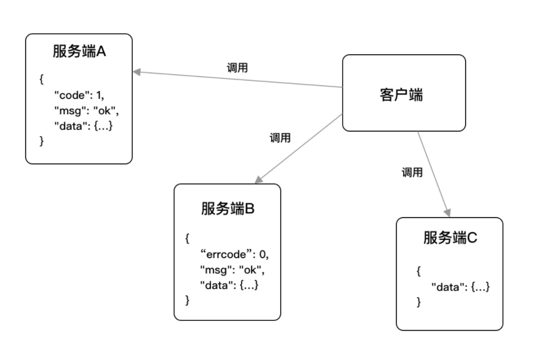

##### Version 0.1

Version 0.1 主要是项目的准备阶段，搭建一个简单的项目，基本实现项目骨架，但项目的鲁棒性不强。

这个部分主要分为三个阶段：
- 项目设计
- 公共组件
- 接口文档

## 1. 项目设计

### 1.1 目录结构设计


目录结构如下：

- configs：配置文件。
- docs：文档集合。
- global：全局变量。
- internal：内部模块。
  - dao：数据访问层（Database Access Object），所有与数据相关的操作都会在 dao 层进行，例如 MySQL、ElasticSearch 等。
  - middleware：HTTP 中间件。
  - model：模型层，用于存放 model 对象。
  - routers：路由相关逻辑处理。
  - service：项目核心业务逻辑。
- pkg：项目相关的模块包。
  - app
  - convert
  - errcode
  - logger
  - setting
- storage：项目生成的临时文件。
- scripts：各类构建，安装，分析等操作的脚本。
- third_party：第三方的资源工具，例如 Swagger UI。

### 1.1.1 数据库设计

实现两大基础业务功能：

- 标签管理
- 文章管理


#### 创建数据库

```mysql
CREATE DATABASE
IF NOT EXISTS blog_service DEFAULT CHARACTER SET utf8mb4 DEFAULT COLLATE utf8mb4_general_ci;
```

#### 标签表

```mysql
CREATE TABLE `blog_tag` (
  `id` int(10) unsigned NOT NULL AUTO_INCREMENT,
  `name` varchar(100) DEFAULT '' COMMENT '标签名称',
  `created_on` int(10) unsigned DEFAULT '0' COMMENT '创建时间',
  `created_by` varchar(100) DEFAULT '' COMMENT '创建人',
  `modified_on` int(10) unsigned DEFAULT '0' COMMENT '修改时间',
  `modified_by` varchar(100) DEFAULT '' COMMENT '修改人',
  `deleted_on` int(10) unsigned DEFAULT '0' COMMENT '删除时间',
  `is_del` tinyint(3) unsigned DEFAULT '0' COMMENT '是否删除 0 为未删除、1 为已删除',
  `state` tinyint(3) unsigned DEFAULT '1' COMMENT '状态 0 为禁用、1 为启用',
  PRIMARY KEY (`id`)
) ENGINE=InnoDB DEFAULT CHARSET=utf8mb4 COMMENT='标签管理';
```

#### 文章表

```mysql
CREATE TABLE `blog_article` (
  `id` int(10) unsigned NOT NULL AUTO_INCREMENT,
  `title` varchar(100) DEFAULT '' COMMENT '文章标题',
  `desc` varchar(255) DEFAULT '' COMMENT '文章简述',
  `cover_image_url` varchar(255) DEFAULT '' COMMENT '封面图片地址',
  `content` longtext COMMENT '文章内容',
  `created_on` int(10) unsigned DEFAULT '0' COMMENT '创建时间',
  `created_by` varchar(100) DEFAULT '' COMMENT '创建人',
  `modified_on` int(10) unsigned DEFAULT '0' COMMENT '修改时间',
  `modified_by` varchar(100) DEFAULT '' COMMENT '修改人',
  `deleted_on` int(10) unsigned DEFAULT '0' COMMENT '删除时间',
  `is_del` tinyint(3) unsigned DEFAULT '0' COMMENT '是否删除 0 为未删除、1 为已删除',
  `state` tinyint(3) unsigned DEFAULT '1' COMMENT '状态 0 为禁用、1 为启用',
  PRIMARY KEY (`id`)
) ENGINE=InnoDB DEFAULT CHARSET=utf8mb4 COMMENT='文章管理';
```

#### 文章标签关联表

```mysql
CREATE TABLE `blog_article_tag` (
  `id` int(10) unsigned NOT NULL AUTO_INCREMENT,
  `article_id` int(11) NOT NULL COMMENT '文章 ID',
  `tag_id` int(10) unsigned NOT NULL DEFAULT '0' COMMENT '标签 ID',
  `created_on` int(10) unsigned DEFAULT '0' COMMENT '创建时间',
  `created_by` varchar(100) DEFAULT '' COMMENT '创建人',
  `modified_on` int(10) unsigned DEFAULT '0' COMMENT '修改时间',
  `modified_by` varchar(100) DEFAULT '' COMMENT '修改人',
  `deleted_on` int(10) unsigned DEFAULT '0' COMMENT '删除时间',
  `is_del` tinyint(3) unsigned DEFAULT '0' COMMENT '是否删除 0 为未删除、1 为已删除',
  PRIMARY KEY (`id`)
) ENGINE=InnoDB DEFAULT CHARSET=utf8mb4 COMMENT='文章标签关联';
```

### 1.1.2 创建Model

创建Model的目的是要和数据库表对应起来

#### 创建公共Model

在 internal/model 目录下创建 model.go 文件，写入如下代码：

```go
type Model struct {
	ID         uint32 `gorm:"primary_key" json:"id"`
	CreatedBy  string `json:"created_by"`
	ModifiedBy string `json:"modified_by"`
	CreatedOn  uint32 `json:"created_on"`
	ModifiedOn uint32 `json:"modified_on"`
	DeletedOn  uint32 `json:"deleted_on"`
	IsDel      uint8  `json:"is_del"`
}
```

#### 创建标签Model

在internal/model 目录下创建tag.go 文件，写入如下代码：

```go
type Tag struct {
	*Model
	Name  string `json:"name"`
	State uint8  `json:"state"`
}

func (t Tag) TableName() string {
	return "blog_tag"
}
```

#### 创建文章Model

在 internal/model 目录下创建article.go文件，写入如下代码：

```go
type Article struct {
	*Model
	Title         string `json:"title"`
	Desc          string `json:"desc"`
	Content       string `json:"content"`
	CoverImageUrl string `json:"cover_image_url"`
	State         uint8  `json:"state"`
}

func (a Article) TableName() string {
	return "blog_article"
}
```

#### 创建标签-文章Model

```go
type ArticleTag struct {
	*Model
	TagID     uint32 `json:"tag_id"`
	ArticleID uint32 `json:"article_id"`
}

func (a ArticleTag) TableName() string {
	return "blog_article_tag"
}
```

### 1.1.3 创建路由

在完成数据库的设计后，我们需要对业务模块的管理接口进行设计，而在这一块最核心的就是增删改查，我们应该使用RESTful 风格的API，具体来说就是

- GET：读取/检索动作。
- POST：新增/新建动作。
- PUT：更新动作，用于更新一个完整的资源，要求为幂等。
- PATCH：更新动作，用于更新某一个资源的一个组成部分，也就是只需要更新该资源的某一项，就应该使用 PATCH 而不是 PUT，可以不幂等。
- DELETE：删除动作。

#### 标签管理

| 功能         | HTTP 方法 | 路径      |
| ------------ | --------- | --------- |
| 新增标签     | POST      | /tags     |
| 删除指定标签 | DELETE    | /tags/:id |
| 更新指定标签 | PUT       | /tags/:id |
| 获取标签列表 | GET       | /tags     |

#### 文章管理

| 功能         | HTTP 方法 | 路径          |
| ------------ | --------- | ------------- |
| 新增文章     | POST      | /articles     |
| 删除指定文章 | DELETE    | /articles/:id |
| 更新指定文章 | PUT       | /articles/:id |
| 获取指定文章 | GET       | /articles/:id |
| 获取文章列表 | GET       | /articles     |

#### 路由管理

确定了业务接口设计后，需要对业务接口进行一个基础编码，确定其方法原型。在项目目录下的 internal/routers 下新建 router.go，写入代码：

```go
func NewRouter() *gin.Engine {
	r := gin.New()
	r.Use(gin.Logger())
	r.Use(gin.Recovery())
	
	article := v1.NewArticle()
    tag := v1.NewTag()
    apiv1 := r.Group("/api/v1")
    {
        apiv1.POST("/tags", tag.Create)
        apiv1.DELETE("/tags/:id", tag.Delete)
        apiv1.PUT("/tags/:id", tag.Update)
        apiv1.PATCH("/tags/:id/state", tag.Update)
        apiv1.GET("/tags", tag.List)

        apiv1.POST("/articles", article.Create)
        apiv1.DELETE("/articles/:id", article.Delete)
        apiv1.PUT("/articles/:id", article.Update)
        apiv1.PATCH("/articles/:id/state", article.Update)
        apiv1.GET("/articles/:id", article.Get)
        apiv1.GET("/articles", article.List)
    }

	return r
}
```

#### 处理程序

在 internal/routers/api/v1 下新建tag.go 和 article.go，写入如下代码

```go
// tag.go
type Tag struct {}

func NewTag() Tag {
	return Tag{}
}

func (t Tag) Get(c *gin.Context) {}
func (t Tag) List(c *gin.Context) {}
func (t Tag) Create(c *gin.Context) {}
func (t Tag) Update(c *gin.Context) {}
func (t Tag) Delete(c *gin.Context) {}
```

```go
// article.go
type Article struct{}

func NewArticle() Article {
	return Article{}
}

func (a Article) Get(c *gin.Context) {}
func (a Article) List(c *gin.Context) {}
func (a Article) Create(c *gin.Context) {}
func (a Article) Update(c *gin.Context) {}
func (a Article) Delete(c *gin.Context) {}
```

### 1.1.4 启动接入

修改main.go的代码

```go
func main() {
	router := routers.NewRouter()
	s := &http.Server{
		Addr:           ":8080",
		Handler:        router,
		ReadTimeout:    10 * time.Second,
		WriteTimeout:   10 * time.Second,
		MaxHeaderBytes: 1 << 20,
	}
	s.ListenAndServe()
}
```

------

------------

上面我们已经完成了前期准备的第一步，搭建好了基础骨架，接下来我们要进一步完善项目，使其变得更加鲁棒，能够稳定运行。

## 1.2 公共组件

实际上在每个公司的项目中，都会有一类组件，我们常称其为基础组件，又或是公共组件，它们是不带强业务属性的，串联着整个应用程序，一般由负责基建或第一批搭建的该项目的同事进行梳理和编写，如果没有这类组件，谁都写一套，是非常糟糕的，并且这个应用程序是无法形成闭环的。

这一节我们将使用以下五个组件，来保证应用程序的标准化，这些也是Web应用中最常用的一些基础组件。


### 1.2.1 错误码标准化

在与客户端的交互过程中，有两种交互可能：**正确响应下的结果集返回、错误相应的错误码和消息体返回**，但是在错误返回时，往往可能有多种多样的错误，因此需要错误码的标准化处理，提前预判，会造成较大的麻烦，其实这部分用swich-case就可以解决，但我们将他们封装起来，更加标准化。



#### 公共错误码

在在项目目录下的 `pkg/errcode` 目录新建 common_code.go 文件，用于预定义项目中的一些公共错误码，便于引导和规范大家的使用

```go
var (
	Success                   = NewError(0, "成功")
	ServerError               = NewError(10000000, "服务内部错误")
	InvalidParams             = NewError(10000001, "入参错误")
	NotFound                  = NewError(10000002, "找不到")
	UnauthorizedAuthNotExist  = NewError(10000003, "鉴权失败，找不到对应的 AppKey 和 AppSecret")
	UnauthorizedTokenError    = NewError(10000004, "鉴权失败，Token 错误")
	UnauthorizedTokenTimeout  = NewError(10000005, "鉴权失败，Token 超时")
	UnauthorizedTokenGenerate = NewError(10000006, "鉴权失败，Token 生成失败")
	TooManyRequests           = NewError(10000007, "请求过多")
)
```

#### 错误处理

在`pkg/errcode`目录新建 errcode.go 文件，编写常用的一些错误处理公共方法，标准化我们的输出

```go
type Error struct{
    code 	int 	`json:code`
    msg 	string	`json:msg`
    details []string `json:details`
}

var code map[int]string{}

func NewError(code int, msg string) *Error {
	if _, ok := codes[code]; ok {
		panic(fmt.Sprintf("错误码 %d 已经存在，请更换一个", code))
	}
	codes[code] = msg
	return &Error{code: code, msg: msg}
}

func (e *Error) Error() string {
	return fmt.Sprintf("错误码：%d, 错误信息:：%s", e.Code(), e.Msg())
}

func (e *Error) Code() int {
	return e.code
}

func (e *Error) Msg() string {
	return e.msg
}

func (e *Error) Msgf(args []interface{}) string {
	return fmt.Sprintf(e.msg, args...)
}

func (e *Error) Details() []string {
	return e.details
}

func (e *Error) WithDetails(details ...string) *Error {
	newError := *e
	newError.details = []string{}
	for _, d := range details {
		newError.details = append(newError.details, d)
	}

	return &newError
}

func (e *Error) StatusCode() int {
	switch e.Code() {
	case Success.Code():
		return http.StatusOK
	case ServerError.Code():
		return http.StatusInternalServerError
	case InvalidParams.Code():
		return http.StatusBadRequest
	case UnauthorizedAuthNotExist.Code():
		fallthrough
	case UnauthorizedTokenError.Code():
		fallthrough
	case UnauthorizedTokenGenerate.Code():
		fallthrough
	case UnauthorizedTokenTimeout.Code():
		return http.StatusUnauthorized
	case TooManyRequests.Code():
		return http.StatusTooManyRequests
	}
	return http.StatusInternalServerError
}
```

### 1.2.2 配置管理

